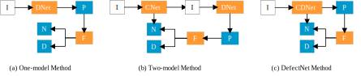
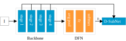
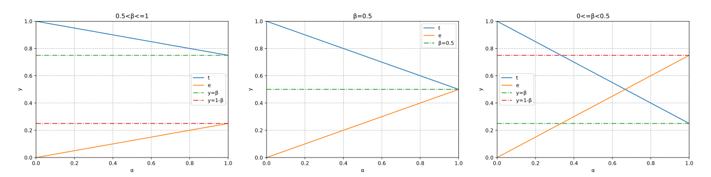
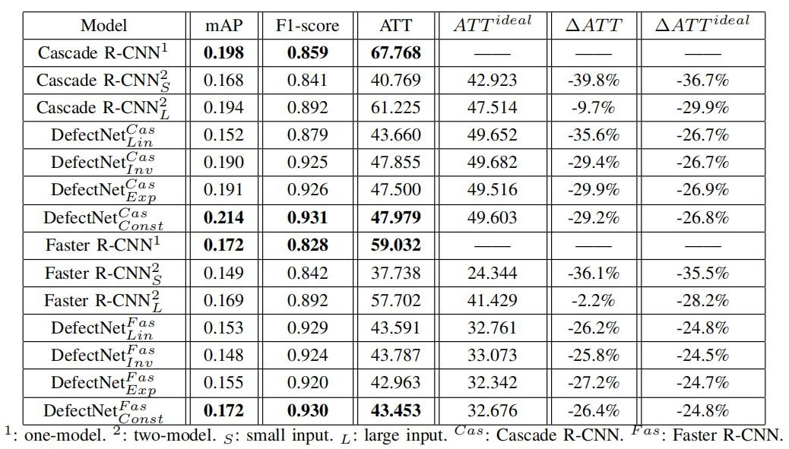
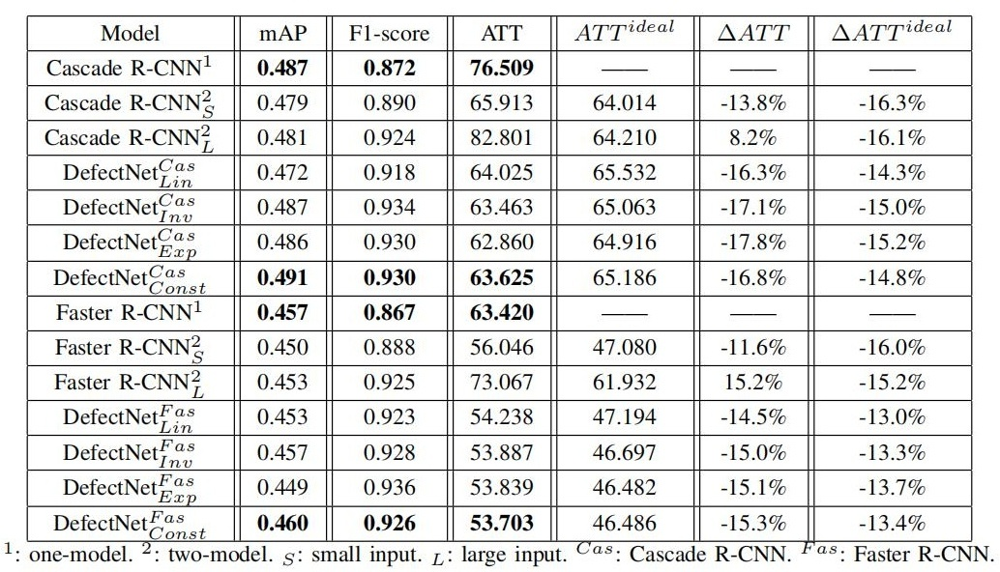

## DefectNet
DefectNet, a defect detection network model for fast and effective defect detection. 

    @ARTICLE{9381247,
      author={F. {Li} and F. {Li} and Q. {Xi}},
      journal={IEEE Transactions on Instrumentation and Measurement}, 
      title={DefectNet: Toward Fast and Effective Defect Detection}, 
      year={2021},
      volume={70},
      number={},
      pages={1-9},
      doi={10.1109/TIM.2021.3067221}}

The full paper is available at [IEEE Transactions on Instrumentation and Measurement](https://ieeexplore.ieee.org/document/9381247)

## Abstract
The existing object detection algorithms based on the convolutional neural 
network (CNN) are always devoted to the detection of natural objects and 
have achieved admirable detection effects. At present, these detection 
algorithms have been applied to the detection of defect data. In fact, 
the detection of defect data **is different from** the detection of general natural
object data and the application of a general object 
detection algorithm based on CNN may **not be perfect** in this problem. 
Therefore, a novel defect detection network (DefectNet) is proposed 
to solve the problem of defect detection. 

There are three methods used to detect defects, which are shown in Fig. 1.

Fig. 1. Three methods of defect detection process. 
I: input image. DNet: object detection network. P: predicted output results, 
including boxes, categories and scores. F: filtered boxes, categories and 
scores by using a score threshold. N: normal images. D: detected defect results. 
CNet: binary classification network. CDNet: defect network. (a) One-model method.
(b) Two-model method. (c) DefectNet method.

## Network Design

- **Defect Finding Network**

    It resumes the last full connection layer in the backbone network.

    

    Fig. 2. Structure of defect finding network. I: input image. D: defective
    images. D-SubNet: the rest of the object detection network except the
    backbone network.

- **Balance Different Network**

    The loss1 is the task of the bounding box regression, the loss2 is 
    the task of bounding box classification, the loss3 is the task of 
    the defect finding.
    
    
    
    There are two methods to set the value of f (w), one is to directly
    set f (w) as a constant (Const) value, the other is to set f (w)
    as the change of the number of iterations n.

    

    There are mainly three different types of fundamental functions for
    variable loss weight strategies: linear (Lin), inverse (Inv) and 
    exponential (Exp) function.
    
    

#### Detection Efficiency

The relationship between the ATT t and the improvement
efficiency e changes as the proportion α of the number of
normal images in all images is shown in Fig. 3.

Fig. 3. Ideal evaluation results for different proportions α. α is 
the proportion of the number of normal images in test set. β is the 
ratio of the ATT_N to the ATT_D. t is the ATT of test set. e is the 
improvement efficiency of test set.

## Experimental Results

- **Fabric Defect**

    Results comparison between DEFECTNET and other SOTA networks in fabric 
    defect dataset is shown in Tab. 1.    
    

- **Bottle Defect**

    Results comparison between DEFECTNET and other SOTA networks in bottled 
    liquor dataset is shown in Tab. 2.    
    

## Installation

This project is based on [MMDetection](https://github.com/open-mmlab/mmdetection).
More installation and usage please refer to [MMDetection](https://github.com/open-mmlab/mmdetection).

    git clone https://github.com/li-phone/DefectNet.git
    # mirror: https://gitee.com/liphone/DefectNet.git
    cd DefectNet
    pip install -r requirements.txt
    bash setup.sh
    
## Prepare Dataset

- **Fabric Defect Dataset**

    **Baidu Disk**: https://pan.baidu.com/s/1b7eFGkrgTm4F0Ww-hATqVw, Password:6oj8

    **DuBox**: https://dubox.com/s/1QhGpKcEDNjwj9vis5iYWzw, Password:vx3h
    
    A detailed introduction to the fabric defect data set:
    
    |            | Total    | Normal   | Defective    | Normal Proportion |
    |------------|:--------:|:--------:|:------------:|:-----------------:|
    | all        | 8325     | 3663     | 4662         | 0.44              |
    | train      | 6660     | 2913     | 3747         | 0.44              | 
    | test       | 1665     | 750      | 915          | 0.45              |

- **Bottle Defect Dataset**
 
    **Baidu Disk**: https://pan.baidu.com/s/1RH0-hqGOWa-sgbAUdRQmGg, Password：yd4b 
    
    A detailed introduction to the bottle defect data set:

    |            | Total    | Normal   | Defective    | Normal Proportion |
    |------------|:--------:|:--------:|:------------:|:-----------------:|
    | all        | 4516     | 1146     | 3370         | 0.25              |
    | train      | 3612     | 921      | 2691         | 0.25              | 
    | test       | 904      | 225      | 679          | 0.25              |
    
## Train and Test

    cd tools
    ln -s {data directory} data 
    python demo.py
    # wait...

<!--
#### Results

Test on GTX 2080Ti GPU: 

- **Fabric defect dataset**

| Model            | mAP    | F1-score   | ATT(MS)  | ATT_defective(MS)    | ATT_normal(MS)   | Remark |
|------------|:--------:|:--------:|:------------:|:-----------------|:-----------------|:-----------------|
|one-model         | 0.198 | 0.859 | 67.768   |     68.281    |    67.142  |cascade_rcnn_r50_fpn_1x|
|two-model_small| 0.168 | 0.841 | **40.769**   |      64.404      |      11.934     |r50_e52+cascade_rcnn_r50_fpn_1x| 
|two-model_large| 0.194 | 0.892 | 61.225      |      87.360      |      29.340      |r50_e12+cascade_rcnn_r50_fpn_1x| 
|defectnet_const| **0.214** | **0.931** | 47.979    |    65.573       |     26.513      |defectnet_const+cascade_rcnn_r50_fpn_1x| 
|defectnet_linear| 0.152 | 0.879 | 43.660   |    59.611   |     24.199    |defectnet_linear+cascade_rcnn_r50_fpn_1x| 
|defectnet_inverse| 0.190 | 0.925 | 47.855   |      65.300        |   26.572      |defectnet_inverse+cascade_rcnn_r50_fpn_1x| 
|defectnet_exponential| 0.191 | 0.926 | 47.500  |      65.032    |     26.110       |defectnet_exponential+cascade_rcnn_r50_fpn_1x| 

- **Bottle defect dataset**

| Model            | mAP    | F1-score   | ATT(MS)  | ATT_defective(MS)    | ATT_normal(MS)      | Remark |
|------------|:--------:|:--------:|:------------:|:-----------------|:-----------------|:-----------------|
|one-model         | 0.487 | 0.872 | 76.509   |   76.614  |     76.194    |cascade_rcnn_r50_fpn_1x|
|two-model_small| 0.479 | 0.890 | 65.913   |  78.772  |   27.107  |r50_e52+cascade_rcnn_r50_fpn_1x| 
|two-model_large| 0.481 | 0.924 | 82.801 |   98.653   |   34.962     |r50_e12+cascade_rcnn_r50_fpn_1x| 
|defectnet_const| **0.491** | 0.930 | 63.625  |  74.671  |  30.291  |defectnet_const+cascade_rcnn_r50_fpn_1x| 
|defectnet_linear| 0.472 | 0.918 | 64.025   |   74.745    |   31.676    |defectnet_linear+cascade_rcnn_r50_fpn_1x| 
|defectnet_inverse| 0.487 | **0.934** | 63.463   |  74.622     |    29.787     |defectnet_inverse+cascade_rcnn_r50_fpn_1x| 
|defectnet_exponential| 0.486 | 0.930 | **62.860**      |   74.080  |  29.001 |defectnet_exponential+cascade_rcnn_r50_fpn_1x| 

Test on GTX 1080Ti GPU: 

- **Bottle defect dataset**

| Model            | mAP    | F1-score   | ATT(MS)    | Remark |
|------------|:--------:|:--------:|:------------:|:-----------------|
|one-model         |  0.490 |  0.870 |  81.186         |cascade_rcnn_r50_fpn_1x|
|two-model_small|  0.483 |  0.872 | **65.079**     |r50_e52+cascade_rcnn_r50_fpn_1x| 
|two-model_large| 0.485 |  0.917 | 94.617     |r50_e12+cascade_rcnn_r50_fpn_1x| 
|defectnet_const| 0.491 |  0.938 |  65.646 |defectnet_const+cascade_rcnn_r50_fpn_1x| 
|defectnet_linear|  0.471 |  0.926 | 68.651    |defectnet_linear+cascade_rcnn_r50_fpn_1x| 
|defectnet_inverse| **0.495** | **0.942** |  67.850     |defectnet_inverse+cascade_rcnn_r50_fpn_1x| 
|defectnet_exponential|  0.489 | 0.934 | 67.889 |defectnet_exponential+cascade_rcnn_r50_fpn_1x| 
 -->

## License

This project is released under the [Apache 2.0 license](LICENSE).

